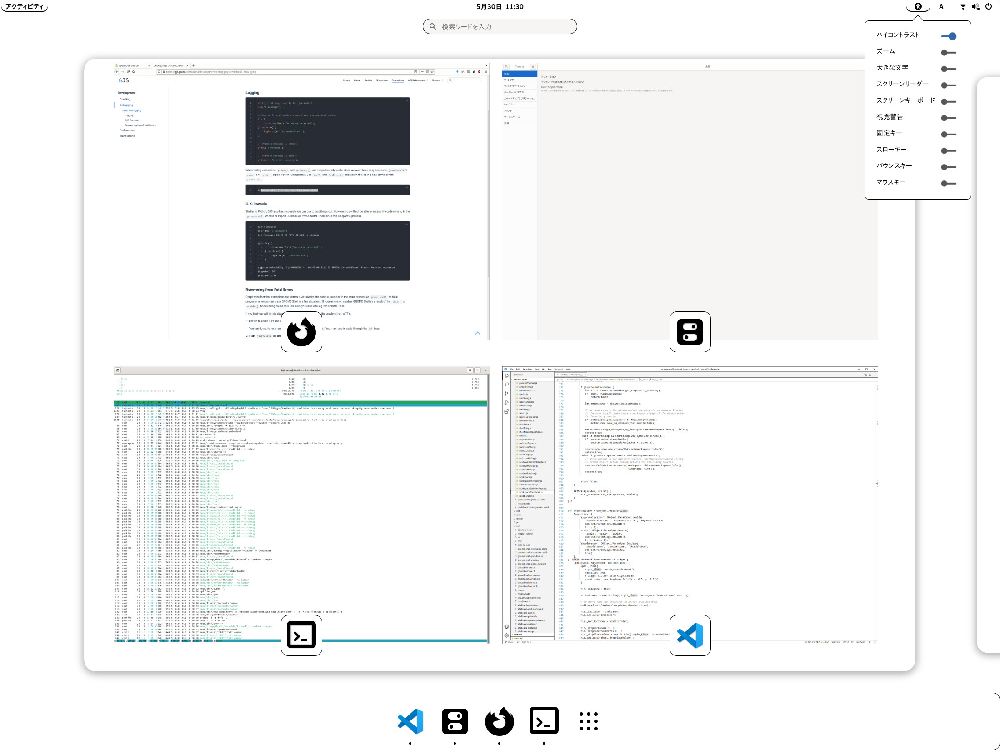

# GNOME Shell Theme: E-Ink

* White background with black borders
* Suitable for E-Ink displays

## Install

1. Install [User Themes](https://extensions.gnome.org/extension/19/user-themes/) and [Gnome Tweaks](https://wiki.gnome.org/Apps/Tweaks)
1. Download `E-Ink.zip` from [Releases](https://github.com/fujimo-t/gnome-shell-theme-e-ink/releases)
2. Open it from `Tweaks > Appearance > Thems`
