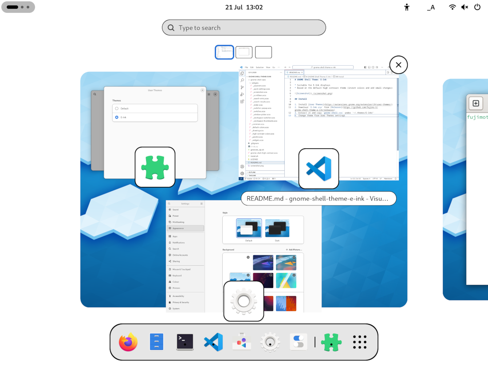

# GNOME Shell Theme: E-Ink

* Suitable for E-Ink displays
* Based on [light style](https://extensions.gnome.org/extension/6198/light-style/) and just added small changes 

## Install

1. Install [User Themes](https://extensions.gnome.org/extension/19/user-themes/)
2. Download `E-Ink.zip` from [Releases](https://github.com/fujimo-t/gnome-shell-theme-e-ink/releases)
3. Extract it and copy `gnome-shell.css` under '~/.themes/E-Ink/'
4. Change theme from User Themes settings